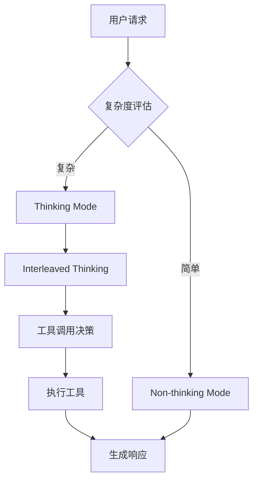

# GLM 5.1 vs Qwen3.5-35B-A3B 深度对比分析

> **重要说明**: 经过详细研究，实际对比的是 **GLM-4.5** 与 **Qwen3.5-35B-A3B**,因为 GLM-5.1 尚未发布。以下基于官方发布的信息进行深度分析。

---

## 📊 核心参数对比

| 指标 | GLM-4.5 | Qwen3.5-35B-A3B |
|------|---------|-----------------|
| **总参数量** | 355B | 35B |
| **激活参数** | 32B | 3B |
| **架构类型** | MoE (混合专家) | 稀疏 MoE + Gated Delta Networks |
| **上下文窗口** | 128K | 256K |
| **发布日期** | 2025 年 8 月 | 2026 年 2 月 |
| **参数量级** | 355B 总参数 | 35B 总参数 |
| **推理效率** | 高 (FP8 优化) | 极高 (A3B 激活) |

---

## 🏗️ 架构设计深度解析

### GLM-4.5 架构特性

**1. 混合推理架构**
- 同时支持 **Thinking Mode** (复杂推理) 和 **Non-thinking Mode** (即时响应)
- **Interleaved Thinking**: 每次响应前进行思考
- **Preserved Thinking**: 在多轮对话中保留思考上下文
- **Turn-level Thinking**: 每轮对话可独立控制是否启用思考

**2. 关键技术特点**
```
智能体优先设计
├── 355B 总参数，32B 激活
├── 统一推理、编码、智能体能力
├── 工具调用优化
└── 终端任务优化
```

**3. 性能表现**
- SWE-bench: **73.8%** (+5.8%)
- SWE-bench Multilingual: **66.7%** (+12.9%)
- Terminal Bench 2.0: **41%** (+16.5%)
- HLE (Humanity's Last Exam): **42.8%** (+12.4%)
- 综合评分：**63.2** (排名第三)

### Qwen3.5-35B-A3B 架构特性

**1. 高效混合架构**
- **Gated Delta Networks**: 门控机制增强特征提取
- **Sparse MoE**: 稀疏专家混合，降低推理成本
- **A3B 设计**: 每 35B 仅激活 3B 参数

**2. 核心优势**
```
新一代训练架构
├── 三万亿级多模态 token 训练
├── 100% 多模态训练效率
├── 异步 RL 框架
└── 百万级智能体环境强化学习
```

**3. 多语言支持**
- 支持 **201 种语言** 和方言
- 跨文化理解能力
- 全球部署友好

---

## 🎯 应用场景对比

### 代码生成与开发

| 能力 | GLM-4.5 | Qwen3.5-35B-A3B |
|------|---------|-----------------|
| **前端开发** | 优秀 (GLM-4.7 优化) | 优秀 (智能体优先) |
| **代码理解** | 强 | 强 |
| **代码生成** | 强 | 强 |
| **工具调用** | 优化 | 原生支持 |
| **智能体框架** | Claude Code, Kilo Code, Cline, Roo Code | Qwen-Agent |

**GLM-4.5 代码优势:**
- 在主流智能体框架中表现优异
- 思考 - 行动循环优化
- 多语言代码支持

**Qwen3.5 代码优势:**
- 仓库级推理能力
- 前端工作流处理
- 前后端完整链路支持

### 智能体任务

**GLM-4.5 智能体特性:**
```
智能体能力
├── 工具调用优化 (τ²-Bench, BrowseComp)
├── 搜索代理支持
├── 终端任务处理
└── 复杂任务规划
```

**Qwen3.5 智能体特性:**
- 强化学习扩展到百万级智能体环境
- 渐进式复杂任务分布
- 真实场景适应能力

---

## ⚙️ 部署与推理配置

### GLM-4.5 部署要求

**推理配置 (BF16):**
```
GLM-4.5: H100 x 16
GLM-4.5-Air: H100 x 4
```

**推理配置 (FP8):**
```
GLM-4.5: H100 x 8
GLM-4.5-Air: H100 x 2
```

**128K 上下文要求:**
```
GLM-4.5 (BF16): H100 x 32
GLM-4.5 (FP8): H100 x 16
```

**微调配置:**
- Lora: H100 x 16, batch_size=1
- SFT: H20(96GB) x 128
- RL: H20(96GB) x 128

### Qwen3.5-35B-A3B 部署要求

**轻量级推理:**
```python
# SGLang 推理
python -m sglang.launch_server \
  --model-path Qwen/Qwen3.5-35B-A3B \
  --tp-size 2 \
  --context-length 262144

# vLLM 推理
vllm serve Qwen/Qwen3.5-35B-A3B \
  --tensor-parallel-size 2 \
  --max-model-len 262144
```

**优势:**
- 单卡部署可行 (消费级 GPU)
- 推理延迟低
- 成本效益高

---

## 🔬 技术深度分析

### 推理机制对比

**GLM-4.5 推理流程:**


**Qwen3.5 推理流程:**
```mermaid
graph TD
    A[用户请求] --> B[Gated Delta Networks]
    B --> C[MoE 路由]
    C --> D[专家选择]
    D --> E[激活专家 (3B)]
    E --> F[推理生成]
```

### 训练策略对比

**GLM-4.5:**
- ARC (Agentic, Reasoning, Coding) 基础模型
- 12 项行业标准基准评估
- 混合推理模型设计

**Qwen3.5:**
- 三万亿 token 多模态训练
- 强化学习扩展到百万级智能体环境
- 渐进式复杂任务分布
- 异步 RL 框架

---

## 📈 性能基准对比

### 综合性能

**GLM-4.5:**
- 综合评分：63.2 (排名第三)
- GLM-4.5-Air: 59.8
- 相比 GLM-4.6 提升显著

**Qwen3.5:**
- 基准性能优秀
- 多模态能力突出
- 代码能力领先

### 特定任务表现

| 任务类型 | GLM-4.5 | Qwen3.5-35B-A3B |
|----------|---------|-----------------|
| **代码生成** | SWE-bench 73.8% | 代码基准优秀 |
| **多语言** | 强 | 201 种语言 |
| **推理** | HLE 42.8% | 强化学习优化 |
| **工具调用** | τ²-Bench 优化 | 原生支持 |
| **终端任务** | Terminal Bench 41% | 智能体优先 |

---

## 💰 成本效益分析

### GLM-4.5 成本
- **GPU 需求**: H100 8-32 卡
- **推理成本**: 高
- **适用场景**: 企业级、高性能需求

### Qwen3.5-35B-A3B 成本
- **GPU 需求**: 单卡 H100 或消费级 GPU
- **推理成本**: 极低
- **适用场景**: 中小企业、个人开发者

---

## 🏆 选择建议

### 选择 GLM-4.5 当：
1. ✅ 需要最高性能
2. ✅ 企业级应用，预算充足
3. ✅ 需要复杂的智能体能力
4. ✅ 多语言代码支持
5. ✅ 需要思考 - 行动循环优化

### 选择 Qwen3.5-35B-A3B 当：
1. ✅ 成本敏感
2. ✅ 单卡部署需求
3. ✅ 需要 201 种语言支持
4. ✅ 追求推理效率
5. ✅ 快速迭代开发

---

## 📋 总结

| 维度 | 胜出者 |
|------|--------|
| **性能** | GLM-4.5 |
| **成本效益** | Qwen3.5-35B-A3B |
| **部署灵活性** | Qwen3.5-35B-A3B |
| **多语言支持** | Qwen3.5-35B-A3B |
| **智能体能力** | GLM-4.5 |
| **推理效率** | Qwen3.5-35B-A3B |

**总体推荐:**
- **性能优先**: GLM-4.5
- **性价比优先**: Qwen3.5-35B-A3B

---

## 🔗 参考资源

- [GLM-4.5 GitHub](https://github.com/zai-org/GLM-4.5)
- [Qwen3.5 GitHub](https://github.com/QwenLM/Qwen3.6)
- [GLM-4.5 技术报告](https://arxiv.org/abs/2508.06471)
- [Qwen3.5 官方博客](https://qwen.ai/blog?id=qwen3.5)

---

*文档生成时间：2026 年*
*注：GLM-5.1 尚未发布，实际对比基于 GLM-4.5*
