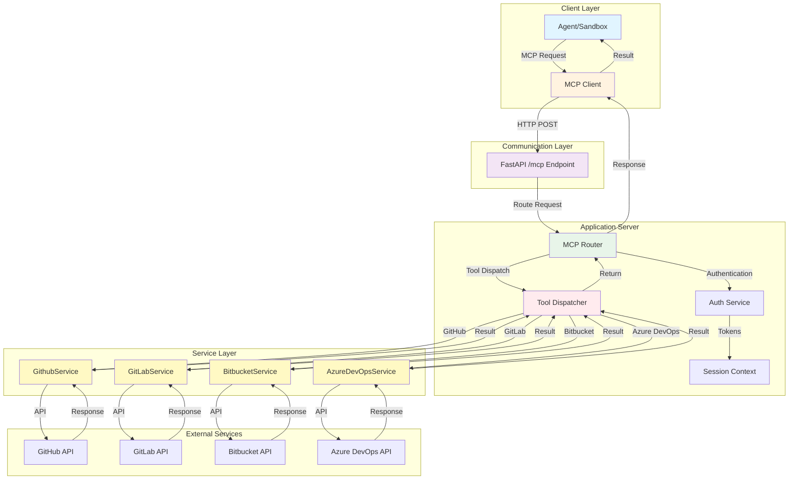
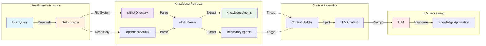
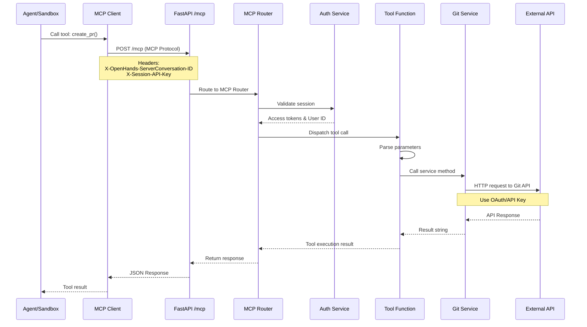
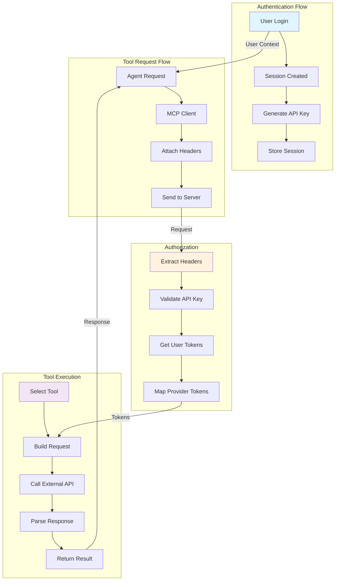
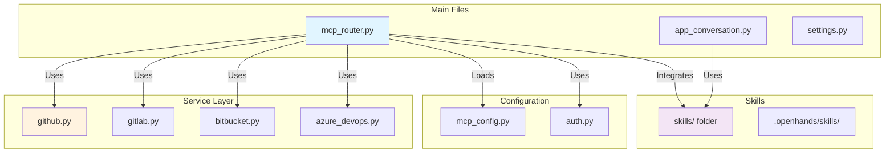

# OpenHands Tool 执行链路图

## 1. MCP 工具完整执行链路



## 2. Skills/Microagents 执行链路



## 3. 详细的 MCP 工具调用序列图



## 4. 配置与初始化流程

```mermaid
graph TD
    subgraph "Application Startup"
        A[FastAPI App Start] --> B[Initialize MCP Server]
        B --> C[Load Tool Definitions]
        C --> D[Register Tools with Router]
    end

    subgraph "Conversation Start"
        E[Create Conversation] --> F[Get User Settings]
        F --> G[Extract MCP Config]
        G --> H[Generate MCP URL]
        H --> I[Set HTTP Headers]
    end

    subgraph "Tool Configuration"
        J[MCP Client] --> K[Configure Server]
        K --> L[Set URL & Headers]
        L --> M[Ready to Call Tools]
    end

    D -.->|Expose| N[/mcp Endpoint]
    I -->|Pass to| J
    N -.->|Available to| J

    style A fill:#e1f5ff
    style E fill:#fff3e0
    style J fill:#f3e5f5
```

## 5. 关键组件关系图

```mermaid
graph LR
    subgraph "Core Components"
        A[FastMCP Server]
        B[MCP Router]
        C[MCP Client]
    end

    subgraph "Service Layer"
        D[GithubService]
        E[GitLabService]
        F[BitbucketService]
        G[AzureDevOpsService]
    end

    subgraph "Supporting Systems"
        H[Auth Service]
        I[Session Manager]
        J[Settings Store]
    end

    subgraph "External Systems"
        K[Git APIs]
        L[Tavily API]
    end

    A -->|Defines| B
    A -->|Exposes| M[/mcp Endpoint]
    C -->|Connects| M
    B -->|Uses| D
    B -->|Uses| E
    B -->|Uses| F
    B -->|Uses| G
    B -->|Calls| H
    B -->|Calls| I
    H -->|Gets| J
    D -->|Calls| K
    E -->|Calls| K
    F -->|Calls| K
    G -->|Calls| K

    style A fill:#e1f5ff
    style B fill:#fff3e0
    style M fill:#f3e5f5
    style H fill:#e8f5e9
    style K fill:#ffebee
```

## 6. 数据流与认证流程



## 7. 文件与模块依赖关系



## 8. 执行时间线与并发处理

```mermaid
gantt
    title MCP Tool 执行时间线
    dateFormat X
    axisFormat %s

    section 客户端层
    Agent 请求工具          :0, 10ms
    MCP Client 构建请求      :10, 15ms

    section 网络通信
    HTTP 请求传输           :25, 50ms
    MCP 协议序列化          :75, 30ms

    section 服务器层
    认证验证               :105, 20ms
    工具路由与分发          :125, 15ms

    section 服务层
    调用 Git 服务           :140, 500ms
    等待外部 API 响应        :140, 450ms

    section 响应处理
    解析响应              :590, 20ms
    返回给客户端           :610, 30ms

    section Skills 流程
    触发关键词检测         :0, 5ms
    加载相关技能           :5, 30ms
    注入上下文             :35, 15ms
```



## 关键说明

### 1. 认证与授权流程
- **会话 ID**: 通过 `X-OpenHands-ServerConversation-ID` 头传递
- **API 密钥**: 通过 `X-Session-API-Key` 头传递
- **Provider Tokens**: 通过 OAuth 或 API Key 获取，不直接暴露给沙箱

### 2. 安全性考虑
- MCP 协议提供安全通信
- API 密钥不直接暴露给 Agent
- 所有工具调用通过主应用服务器中转
- 支持请求审计和追踪

### 3. 性能优化
- 支持异步工具调用
- 外部 API 调用可并发
- 响应快速序列化
- 连接池管理

### 4. 扩展性
- 新增工具只需在 Router 添加新函数
- 支持自定义 MCP 服务器配置
- Skills 系统支持动态加载
